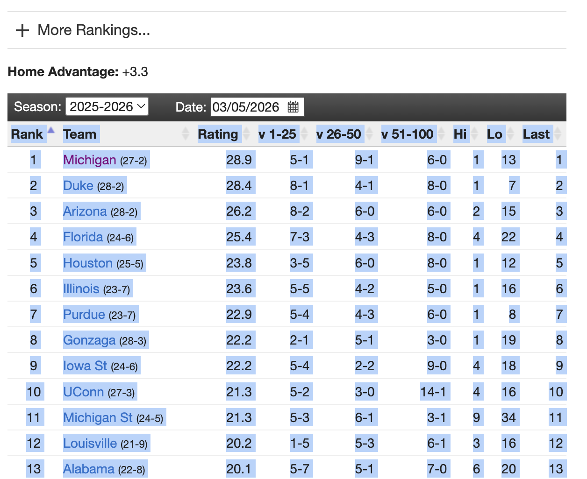

Kaggle March Madness Day 4
------------------------------------------------

If you missed previous Kaggle March Mania labs ([1](https://github.com/jfcross4/advanced_stats/blob/cross/kaggle_mm_day1.md),[2](https://github.com/jfcross4/advanced_stats/blob/cross/kaggle_mm_day2.md),[3](https://github.com/jfcross4/advanced_stats/blob/cross/kaggle_mm_day3.md)), please complete the earlier Kaggle March Madness labs before working on this lab.


In our last lab, we found that TeamRankings.com has had the most accurate team rankings (of the systems we looked at) over the last decade.  In this lab, we'll used TeamRankings.com's ratings from this year to make predictions.  You may decide that you want to use a different system and, if you do, these steps will still (mostly) work with whichever ratings you want to use.

# Getting TeamRankings ratings 

We want to get TeamRankings ratings into a .csv file so that we can read them into an R dataframe.

1. You can start by going to the [TeamRankings website](https://www.teamrankings.com/ncaa-basketball/ranking/predictive-by-other/).  Next highlight the full table including the headers (as shown below) but try not to highlight anything else.



2. Now paste this data into Google Sheets.  Change the name of your Google Sheets file to "TeamRankings" and then go to File/Download and select "Comma Separated Values (.csv)".  You now have this data as a .csv file.

3. Open the March Madness project on posit.cloud that you created in the previous lab.  You will need one of the files that you imported in a previous lab for this lab.  

4. Upload the TeamRankings .csv file you just created into your posit.cloud March Madness project.

5. Reading this files into an R data frame.

Remember that you should save your code from this project in an Rscript file so that you can easily find it and run it again when you need to.

```r
# Check the name of your .csv file and change this code as needed:
TR = read.csv("TeamRankings - Sheet1.csv")
```

Keeping only the columns we need and looking at the data:

```r
TR = TR[, 2:3]
View(TR)
```

# Matching Names with IDs

In order to use these ratings to make predictions, we'll need to match these team names up with Kaggle's team IDs.  This will take a little bit of work for two reasons:

1. The "Team" column currently hold more than just team names including team records in parentheses.

2. Some team names may be written in ways that our Kaggle file doesn't recognize.  For instance, TeamRankings lists the Univsersity of South Florida as "S Florida" and Kaggle team name spellings file contains only "south florida" and "south-florida".  

First, let's clean up the team name column:

```r
# removing all characters other than letters, spaces, periods, ampersands and apostrophes:
TR = 
TR %>%
  mutate(Team = gsub("[^a-zA-Z\\ \\' \\&\\.]", "",Team))

# trimming away extra spaces
TR = 
  TR %>%
  mutate(Team = gsub("\\s+", " ",Team))

TR = 
  TR %>%
  mutate(Team = trimws(Team))

# coverting all letters to lowercase
TR = 
  TR %>%
  mutate(Team = tolower(Team))


View(TR)
```
# Trying to Match the Names

Now, let's see how many names we've matched successfully and how many we've missed:

First read in the MTeamSpellings file:

```r
MTeamSpellings = read.csv("MTeamSpellings.csv")
```

Now, let's see how many names are matched successfully and how many are not:

```r
TRmatched = inner_join(TR, 
                    MTeamSpellings,
                    by=c("Team"="TeamNameSpelling"))
nrow(TRmatched)

TRunmatched = anti_join(TR, 
                    MTeamSpellings,
                    by=c("Team"="TeamNameSpelling"))
nrow(TRunmatched)

```
We've successfully matched 321 teams with ratings but the names didn't match up for the other 44 teams.  We need to do better!

This simple involved looking at the 44 teams that didn't match:

```r
View(TRunmatched)
```

and then, for each team that didn't match, finding their ID in MTeamSpellings.

Then we can make a data frame with these new spelling/ID combinations:

```r
M_new_spellings = 
  data.frame(
    TeamNameSpelling = c("miami",
                         "s florida",
                         "n iowa",
                         "st thomas",
                         "illinois chicago",
                         "e tennessee st",
                         "n texas",
                         "ucsd",
                         "kennesaw st",
                         "kent st",
                         "ut rio grande",
                         "loyola mymt",
                         "middle tenn"), 
    TeamID = c(1274,
               1378,
               1320,
               1472,
               1227,
               1190,
               1317,
               1471,
               1244,
               1245,
               1410,
               1258,
               1292))

```
and add these combinations to the larger list:

```r
MTeamSpellings2 = 
  rbind(MTeamSpellings, M_new_spellings)
```

and then we can try to match names again:

```r
TRmatched = inner_join(TR, 
                    MTeamSpellings2,
                    by=c("Team"="TeamNameSpelling"))
nrow(TRmatched)

TRunmatched = anti_join(TR, 
                    MTeamSpellings2,
                    by=c("Team"="TeamNameSpelling"))
nrow(TRunmatched)
```

We've gone from 44 unmatched to only 31 (of 365) unmatched and the better news is that we've added the spellings for all the *good* unmatched teams that might make the tournament and predictions for teams that won't make the tournament don't matter.  So, we can probably safely stop here.  Let's make a table that has the TeamRankings ratings the the Kaggle team IDs:

```r
TR_with_ids = inner_join(TR, 
                    MTeamSpellings2,
                    by=c("Team"="TeamNameSpelling"))
                    
View(TR_with_ids)
```

Every team with a rating above 0 (roughly the top 160 teams in the country) have been matched.

# Combining Ratings

We only have TeamRankings for Men's teams, so we'll use the Massey ratings for Women's teams.  You should have a data.frame called "massey" that you created in a [previous lab](https://github.com/jfcross4/advanced_stats/blob/cross/kaggle_mm_day2.md).

```r
combined_ratings = 
rbind(massey %>% 
        filter(TeamID >= 3000),
      TR_with_ids %>%
      select(TeamID, Rating)
        )
```

We can still alter ratings (like you did in the second Kaggle lab) in order to make some gambles.  Replace the code below with the ratings alterations that you want to make (or skip this entirely if you'd rather avoid gambles):

```r
combined_ratings = 
  combined_ratings %>%
  mutate(
    Rating = case_when(
    TeamID == 1181 ~ 35,
    TeamID == 3376 ~ 90,
    .default = Rating
    )
  )

```
Lastly, we can run the rest of the code from our [week 2 lab](https://github.com/jfcross4/advanced_stats/blob/cross/kaggle_mm_day2.md) (except using combined ratings instead of massey) to create a .csv file that we can submit to Kaggle.

```r
games_with_ratings = 
  join_games_and_ratings(games, combined_ratings)
```

... but since we didn't match all of the team names there are (bad) teams without a rating.  Again, the ratings for these teams shouldn't matter since they won't make the tournament.  However, we still need to rate them and make predictions for them.  I'll replace all NA ratings with a rating of 0.

```r
games_with_ratings = 
games_with_ratings %>%
  mutate(
    team1rating = ifelse(is.na(team1rating), 0, team1rating),
    team2rating = ifelse(is.na(team2rating), 0, team2rating))
```

Now, finally, we can finish up with the code from our day 2 lab:

```r
games_with_predictions = 
  add_massey_preds(games_with_ratings)

write.csv(unite(games_with_predictions, 
                  col="ID", 
                  Season, team1, team2) %>%
            select(ID, Pred), 
          file="TR_and_massey_kaggle_predictions.csv",
          row.names = FALSE)
```

Further notes:

* You'll want to update any ratings (like Massey or TeamRankings) you plan to use after this coming weekend.

* Think carefully about how you want to differentiate your predictions.

