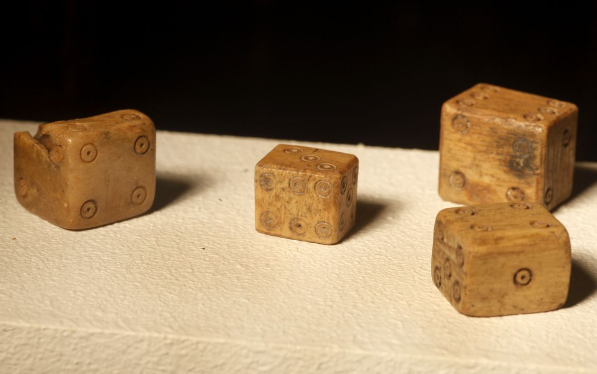

```{r setup, include=FALSE}
knitr::opts_chunk$set(echo = FALSE)
library(knitr)
```

## Suspicious Dice

Ancient Romans used asymmetrical dice.  Let's imagine that we collected data on one of these dice.

{width=80%}

## Dice Results

```{r}
side <- 1:6
num_times <- c(80, 103, 93, 105, 96, 123)
die_results = data.frame(side, num_times)
kable(die_results)
```

## Is it Fair?

Is there compelling evidence that this isn't a fair die?

```{r}
side <- 1:6
num_times <- c(80, 103, 93, 105, 96, 123)
die_results = data.frame(side, num_times)
kable(die_results)
```

## A Little Math

```{r, echo=TRUE}
num_times <- c(80, 103, 93, 105, 96, 123)

expected <- rep(100, 6)

differences = num_times-expected

differences
```

Are these differences larger than we would expect by chance?  How do we capture how big these differences are?

## The Sum of the Absolute Differences?

The "test statistic" could be the sum of the absolute differences

```{r, echo=TRUE}
test_stat = sum(abs(differences))
test_stat
```

Is this a larger sum of the absolute differences that we could reasonably expect due to chance alone?

## Let's Simulate This

The simulation is based on the null hypothesis.  The null hypothesis here could be that all 6 sides are equally likely on every roll.

```{r, echo=TRUE}
roll600 = sample.int(6, 600, replace=TRUE)

roll600
```

## How'd we do?

```{r, echo=TRUE}
table(roll600)

sim_differences = table(roll600)-100

sum(abs(sim_differences))
```

## Let's do this many times!

```{r, cache=TRUE, echo=TRUE}
sim1000 = replicate(1000, {
  roll600 = sample.int(6, 600, replace=TRUE)
  sim_differences = table(roll600)-100
  sum(abs(sim_differences))
})

```

## The Distribution of the Test Statistic

```{r}
hist(sim1000) 
abline(v=test_stat,
         col="red", lwd=3)
```


## A p-value

How often is our simulated test statistic as large or larger than our observed test statistic?

```{r, echo=TRUE}
mean(sim1000 > test_stat)
```

## A Different Test Statistic

Some test statistics are better than others.  The distributions of some test statistics are well understood mathematically.  

The test statistic that people would typically use in this case is the sum of the squared differences each divided by the expected number.  This test statistic is used often enough that it has a name.  It's called a "chi square" value.

$$ \chi^2 = \Sigma \frac{(Observed_i - Expected_i)^2}{Expected_i} $$

## Calculating Chi Square

```{r, echo=TRUE}
num_times <- c(80, 103, 93, 105, 96, 123)

expected <- rep(100, 6)

differences = num_times-expected

(differences^2)/expected

chi_square = sum((differences^2)/expected)

chi_square
```

## Now Let's Do Our Simulation Again!

```{r, cache=TRUE, echo=TRUE}
sim1000chi = replicate(1000, {
  roll600 = sample.int(6, 600, replace=TRUE)
  sim_differences = table(roll600)-100
  sum((sim_differences^2)/100)
})

```

## And Graph Our Simulated Chi Squares

```{r}
hist(sim1000chi) 
abline(v=chi_square,
         col="red", lwd=3)
```

## And we can get a new p-value

```{r, echo=TRUE}
mean(sim1000chi > chi_square)
```

## Chi Square Distribution

Chi square values are understood well enough that we know in advance how many simulations would be distributed:

```{r, echo=FALSE}
curve(dchisq(x, df = 5), from = 0, to = 20)
abline(v=chi_square,
         col="red", lwd=3)
```

## Degrees of Freedom (generally)

Something's "Degrees of Freedom" is number of independent ways of wiggling it has.  

If video games of my youth, characters had two degrees of freedom (up/down, left/right).  Today's video game characters might have many more.  If they can move in 3D space and rotate around two axes, that's 5 degrees of freedom.  

## Degrees of Freedom (more specifically)

Our die rolls results have 5 degrees of freedom and not 6, because if you know how many 1's through 5's we rolled, there's no room for wiggle in how many 6's we rolled.

(Here 6 wiggles that have some dependence between them is the same as 5 independent wiggles.)

## Finding the p-value the easy way

[Chi Square Table](https://people.richland.edu/james/lecture/m170/tbl-chi.html)

```{r, echo=TRUE}
1 - pchisq(chi_square, df=5)

```

## Example 2: Soccer Birth Months (Again)

Elite soccer players by birth month:

```{r, echo=TRUE}
births = c(70, 60, 57, 51, 60, 44, 39, 55, 59, 35, 30, 31)
names(births) = month.name

total_births = sum(births)
births
```

## Expected Births

```{r, echo=TRUE}
days_in_months = c(31, 28.25, 31, 30, 31, 30, 31, 31, 30, 31, 30, 31
)

names(days_in_months) = month.name

expected = total_births*(days_in_months/365.25)

expected
```

## Finding Chi Square

```{r, echo=TRUE}
births-expected

sum((births-expected)^2/expected)
```

## Finding p-value

```{r, echo=TRUE}
soccer_chi = sum((births-expected)^2/expected)

pchisq(soccer_chi, df=11)
1-pchisq(soccer_chi, df=11)
```

## Expected Value of Chi Square Value

Since:

$$ \chi^2 = \Sigma \frac{(Observed_i - Expected_i)^2}{Expected_i} $$
$$ E[\chi^2] = \Sigma \frac{E[(Observed_i - Expected_i)^2]}{Expected_i} $$

Remember: The variance is the mean square deviation from the mean (which is the numerator above), so we could rewrite this as:

$$ E[\chi^2] = \Sigma \frac{Variance_i}{Expected_i} $$

## Expected Value of Chi Square Value (continued)

$$ E[\chi^2] = \Sigma \frac{Variance_i}{Expected_i} $$

The variance in the number of counts in any category is $np_i(1-p_i)$ where p_i is the chance of being in that category.  If we divide this by the expected number of counts in that category $np_i$, we get $1-p_i$. If we sum up $1-p_i$ over all categories, we get the number of categories minus 1... which is the same as the number of degrees of freedom.

So the expected value of chi square is the same as the number of degrees of freedom.
