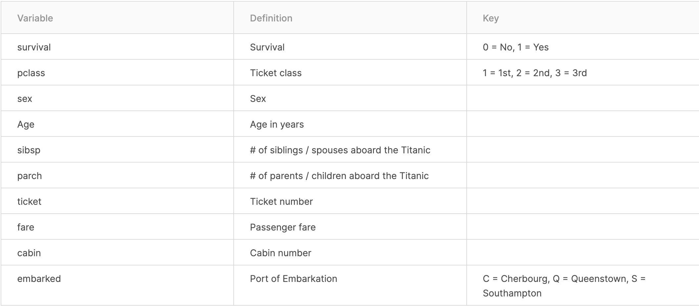

02b Titanic Day One - Follow up!
================
Advanced Statistics

Let's get to making predictions for Titanic passengers.  This time, please create a Titanic project if you haven't already and create an R script and save all of your code in this R script.

First, read in the data:

```r
titanic <- read.csv("https://raw.githubusercontent.com/jfcross4/advanced_stats/master/titanic_train.csv")
```

Recall, what each column means:



Load your favorite package:

```r
library(tidyverse)
```

Create the MAE and RMSE functions:

```r
MAE <- function(x,y){mean(abs(x-y))}
RMSE <- function(x, y){sqrt(mean((x-y)^2))}
```

# Who Lived and Who Died?

You'll probably want to investigate this by grouping by different categories.  For instance:

```r
titanic %>% 
      group_by(Age >= 18) %>%
      summarize(n=n(),
                mean(Survived))
```

(Note: NA values are where the Age of the passenger is missing)


or...

```r
titanic %>% 
    group_by(Pclass) %>%
    summarize(n=n(),
              mean(Survived))
```

or...

```{r}
titanic %>% 
    group_by(Sex) %>%
    summarize(n=n(),
              mean(Survived))
```

or even...

```{r}
titanic %>% 
    group_by(Sex, Pclass) %>%
    summarize(n=n(),
              mean(Survived))
```

or EVEN:

```{r}
titanic %>% 
    group_by(Sex, Age <= 18) %>%
    summarize(n=n(),
              mean(Survived))
```

Notice, how we have to do something different with Age than with Sex or Pclass because Age is a continuous variable (and not a categorical variable).

Look for variables or combinations of variables that are important for predicting who lived and who died.

# Using case_when to make Predictions

Once you've found the important variables and what they imply about someone's chances of survival you can make predictions using a case_when statement as follows:

```r
titanic %>% 
    mutate(pred = case_when(
              Age < 18 ~ 0.540,
              Age >= 18 ~ 0.381,
              is.na(Age) ~ 0.294
    )) %>%
    summarize(mae = MAE(pred, Survived),
              rmse = RMSE(pred, Survived))
```

or

```r
titanic %>% 
    mutate(pred = case_when(
              Sex == "female" ~ 0.7,
              Sex == "male" ~ 0.2
    )) %>%
    summarize(mae = MAE(pred, Survived),
              rmse = RMSE(pred, Survived))
```

or even:

```r
titanic %>% 
    mutate(pred = case_when(
              Sex == "female" ~ 0.7,
              Sex == "male" & Age <= 18 ~ 0.3,
              .default = 0.15
    )) %>%
    summarize(mae = MAE(pred, Survived),
              rmse = RMSE(pred, Survived))
```

In looking at the code above notice the use of "&" for "and" and the use of ".default" to make a prediction for passengers who don't fit into any of the categories already specificies.  

# Challenge 1: 

Devise a system for making "Survived" predicitons with the goal of minimizing RMSE.  You can use any of the following variables: *Sex*, *Age*, *Pclass*, *SibSp*, *Parch*, *Fare*, *Embarked*.  (In other words, for now, you may not use Name, Ticket and Cabin.)

# Challenge 2: 

Devise the system for making the "Survived" predictions that minimizes MAE (with the same restriction on which variables you use).


**Please save your code!  You will be asked to describe your methods and your results.**
